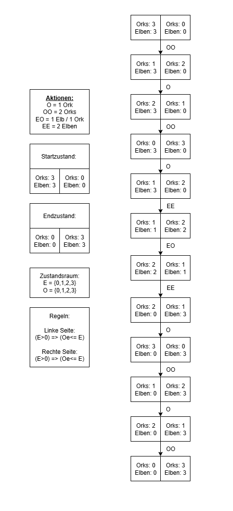

# Grundlagen_KI

In diesem Repository werden die Aufgaben von Grundlagen der KI aus dem 3.Semester Informatik an der HSBI Campus Minden bearbeitet(2025/26)

Die einzelnen Aufgabenblätter werden in Branches dieses Repository´s bearbeitet.

# Blatt 1

## Aufgabe 1 Problemformalisierung

## Aufgabe 2 Suchverfahren

### Breitensuche

| Knoten    | offen Knoten                | besuchte Knoten             |
|-----------|-----------------------------|-----------------------------|
|           | Würzburg                    |                             |
| Würzburg  | Erfurt, Frankfurt, Nürnberg |                             |
| Erfurt    | Frankfurt, Nürnberg         | Würzburg                    |
| Frankfurt | Nürnberg, Kassel, Mannheim  | Würzburg, Erfurt            |
| Nürnberg  | Kassel, Mannheim, München   | Würzburg, Erfurt, Frankfurt |

**Benötigte Schritte:** 5 

### Tiefensuche

| Knoten    | offen Knoten                | besuchte Knoten             |
|-----------|-----------------------------|-----------------------------|
|           | Würzburg                    |                             |
| Würzburg  | Erfurt, Frankfurt, Nürnberg |                             |
| Erfurt    | Frankfurt, Nürnberg         | Würzburg                    |
| Frankfurt | Nürnberg, Kassel, Mannheim  | Würzburg, Erfurt            |
| Nürnberg  | Kassel, Mannheim, München   | Würzburg, Erfurt, Frankfurt |

**Benötigte Schritte:** 3

### A*

**1. Schritt** 
| Knoten    | Entfernung |
|-----------|------------|
| Würzburg-Frankfurt | 317km      |
| Würzburg-Erfurt    | 586km      |
| Würzburg-Nürnberg  | 640km      |

Weiter mit Frankfurt und vergleichen

**2. Schritt**

| Knoten                      | Entfernung |
|-----------------------------|------------|
| Würzburg-Frankfurt-Mannheim | 502km      |
| Würzburg-Frankfurt-Kassel   | 850km      |
| Würzburg-Erfurt             | 586km      |
| Würzburg-Nürnberg           | 640km      |

Weiter mit Mannheim und vergleichen

**3. Schritt**

| Knoten    | Entfernung |
|-----------|------------|
| Würzburg-Frankfurt-Mannheim-Karlsruhe | 392km      |
| Würzburg-Frankfurt-Kassel    | 850km      |
| Würzburg-Erfurt    | 586km      |
| Würzburg-Nürnberg  | 640km      |

Weiter mit Karlsruhe und vergleichen

**4. Schritt**

| Knoten   | Entfernung |
|----------|------------|
| Würzburg-Frankfurt-Mannheim-Karlsruhe-Augsburg | 632km      |
| Würzburg-Frankfurt-Kassel   | 850km      |
| Würzburg-Erfurt   | 586km      |
| Würzburg-Nürnberg | 640km      |

Weiter mit Erfurt und vergleichen

**5. Schritt**

| Knoten   | Entfernung |
|----------|------------|
| Würzburg-Frankfurt-Mannheim-Karlsruhe-Augsburg | 632km      |
| Würzburg-Frankfurt-Kassel   | 850km      |
| Würzburg-Nürnberg | 640km      |

Weiter mit Augsburg und vergleichen

**6. Schritt**

| Knoten   | Entfernung |
|----------|------------|
| Würzburg-Frankfurt-Mannheim-Karlsruhe-Augsburg-München  | 716km      |
| Würzburg-Frankfurt-Kassel   | 850km      |
| Würzburg-Nürnberg | 640km      |

Weiter mit Nürnberg und vergleichen

**7. Schritt**

| Knoten  | Entfernung |
|---------|------------|
| Würzburg-Nürnberg-München | 270km      |
| Kassel  | 850km      |

Die Heuristic ist definitiv falsch, da es sich bei den angenommenen Werten um nicht konsistente und zulässige Werte handelt.
Stattdessen sollte Nürnberg < 170km sein.

**1. Schritt**

| Knoten             | Entfernung |
|--------------------|------------|
| Würzburg-Frankfurt | 317km      |
| Würzburg-Erfurt    | 586km      |
| Würzburg-Nürnberg  | 263km      |

Weiter mit Nürnberg

**2. Schritt**

| Knoten                    | Entfernung |
|---------------------------|------------|
| Würzburg-Frankfurt        | 317km      |
| Würzburg-Erfurt           | 586km      |
| Würzburg-Nürnberg-München | 270km      |

## Aufgabe 3 Dominanz

Eine Heuristik **h1(n)** dominiert eine Heuristik **h2(n)**, wenn für alle Knoten n gilt:
**h1(n)≥h2(n)** und beide heuristisch zulässig sind, d. h. sie überschätzen niemals die tatsächlichen Kosten **h∗(n)** bis zum Ziel.

**Auswirkung A\***

|             Aspekt             |        Mit dominierender Heuristik ( h_1 )        |       Mit schwächerer Heuristik ( h_2 )      |
|:------------------------------:|:-------------------------------------------------:|:--------------------------------------------:|
| Anzahl der expandierten Knoten | Weniger (effizienter, mehr Führung Richtung Ziel) | Mehr (breitere Suche, weniger zielgerichtet) |
| Garantierte Optimalität        | Ja, solange ( h_1 ) zulässig ist                  | Ja, solange ( h_2 ) zulässig ist             |
| Laufzeit                       | Schneller in der Regel                            | Langsamer                                    |
| Speicherbedarf                 | Geringer bis ähnlich (weniger offene Knoten)      | Höher                                        |

Ein Beispiel hierfür ist das Pathfinding von Mobs in Minecraft, bei welchem die Entwickler statt einer normalen Heuristic eine gewichtete Heuristic verweden, wodurch der Algorithmus schneller zum Ziel findet.

## Aufgabe 4 Beweis der Optimalität von A*

Sei $h$ eine zulässige Heuristik, also $h(n) \leq h^*(n)$ für alle Knoten $n$.

Angenommen, A* expandiert als ersten Zielknoten einen Zustand $G$ mit Kosten $g(G) = C$.
Weiter nehmen wir an, es existiere eine bessere Lösung $G^*$ mit geringeren Kosten $g(G^*) = C^* < C$.

Betrachte den optimalen Pfad von Start $S$ zu $G^*$ und den ersten Knoten $n$ auf diesem Pfad, der sich kurz vor der Expansion von $G$ noch in der Frontier befindet.

Für diesen Knoten gilt aufgrund des optimalen Pfades $g(n) + h^*(n) = C^*$, wobei $h^*(n)$ die tatsächlichen Kosten von $n$ bis $G^*$ sind.

Da die Heuristik zulässig ist, gilt $f(n) = g(n) + h(n) \leq g(n) + h^*(n) = C^*$.
Somit gilt $f(n) \leq C^* < C = f(G)$.

A* expandiert jedoch immer den Knoten mit dem kleinsten $f$-Wert zuerst.
Damit müsste also $n$ vor $G$ expandiert werden, was auch zur Expansion von $G^*$ mit geringeren Kosten führen würde.

Das steht im Widerspruch zur Annahme, dass $G$ zuerst expandiert wird und teurer ist.
Folglich kann keine bessere Lösung existieren – die erste von A* gefundene Lösung muss optimal sein.

---
